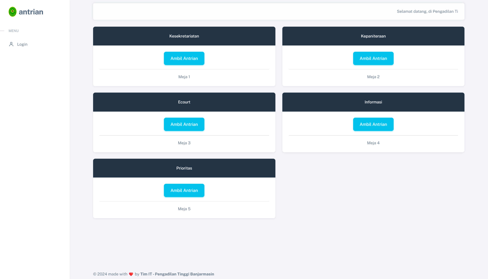
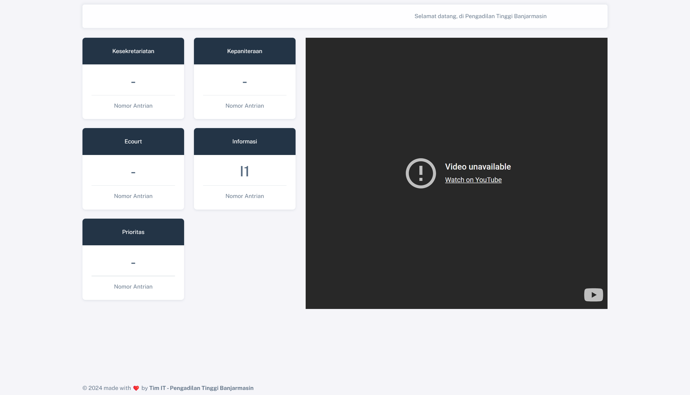
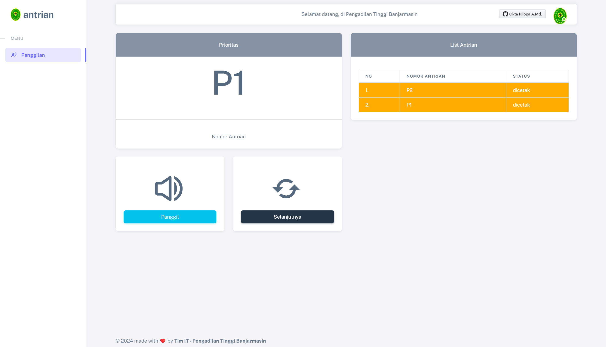
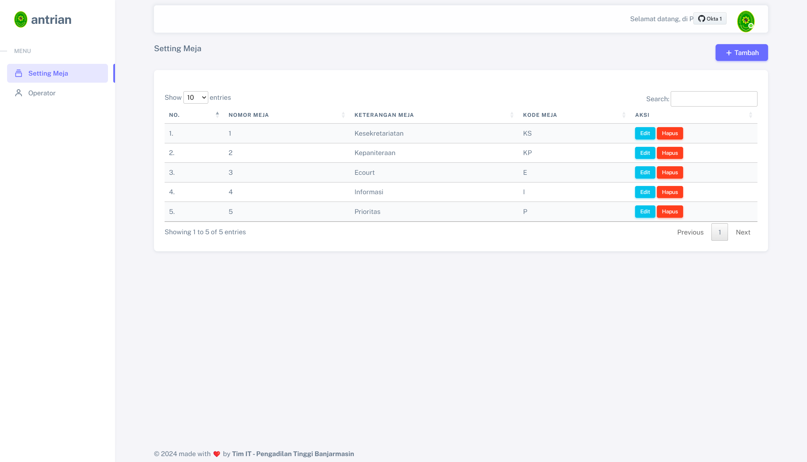
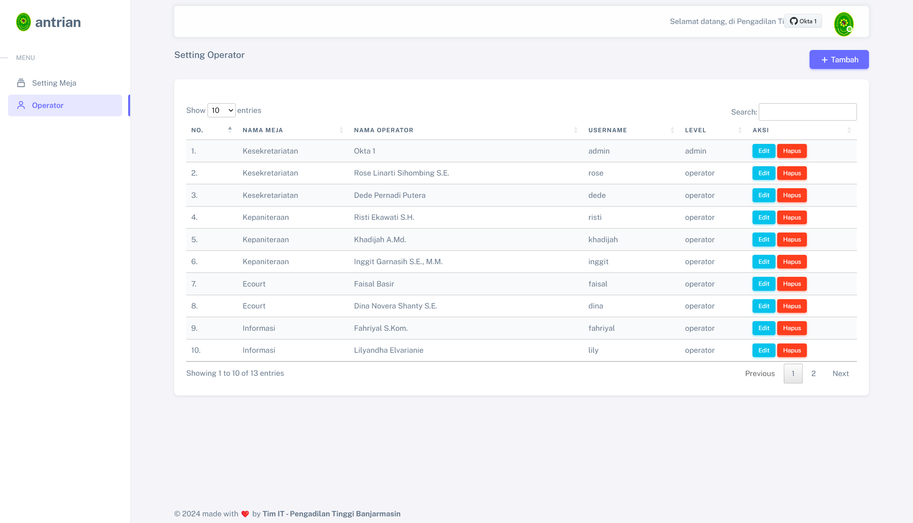

# Aplikasi Antrian

Aplikasi antrian merupakan aplikasi yang dibuat untuk tujuan manajemen antrian pelayanan pada suatu instasi dengan nomor antrian yang dapat di print menggunakan printer thermal pos,

## Persiapan
- PHP 5.6
- Codeigniter 3
- MySql
- Nodejs V16
- Python V3
- Xampp atau Laragon
- Google Chrome (Wajib)

*Sebelum melakukan install aplikasi, silahkan pastikan printer thermal sudah terinstall dan sudah ditesting dapat melakukan print tanpa aplikasi ini.

Disini saya menggunakan printer thermal cla58 atau POS-58

Aplikasi ini terbagi menjadi 3 bagian
1. Server
2. Client
3. Pos-Printer-Python

## 1. Server

Aplikasi yang terdiri dari :

- [Codeigniter 3] 
- [Node JS]

Silahkan copy folder server ke folder htdocs jika menggunakan xampp atau folder www jika menggunakan laragon anda juga bisa merename nama folder server menjadi yang anda inginkan.
Setelah ini ikuti langkah berikut ini:
1. Ubah base url pada file yang berada application/config/config.php, sesuaikan dengan base url yang anda inginkan, biasanya mengikuti nama folder 
2. Ubah konfigurasi database pada file yang berada  application/config/database.php, sesuaikan dengan konfigurasi host, user, password, dan nama database
3. Import file database.sql yang berada di folder antrianci3/database/database.sql ke database anda
4. Buka terminal lakukan perintah `npm install`
5. masih dalam terminal lakukan perintah `node server.js` jika menggunakan pm2 lakukan perintah `pm2 start server.js`
6. Buka browser silahkan akses base url yang sudah di setting sebelum nya, misal nya di sini http://localhost/server/
7. Pastikan node js juga berjalan dengan baik


## 2. Client
Aplikasi yang terdiri dari :
1. Ubah base url pada file yang berada application/config/config.php, sesuaikan dengan base url yang anda inginkan, biasanya mengikuti nama folder 
2. Silahkan ubah config di bawah ini yang berada application/config/config.php, sesuaikan dengan aplikasi anda
3. Buka browser silahkan akses base url yang sudah di setting sebelum nya, misal nya di sini http://localhost/client/

```sh
//setting 
$config['base_url_api'] = 'http://localhost/server/'; //sesuaikan dengan base url aplikasi server
$config['printer_name'] = 'POS-58'; //sesuaikan nama printer anda

// Perintah untuk menjalankan script Python
$config['python_script'] = 'C:/Users/pilopa/Documents/pos-printer-python/printer3.py'; //lokasi aplikasi folder pos-printer-python
$config['python_path'] = 'C:/Users/pilopa/AppData/Local/Programs/Python/Python312/python.exe'; //lokasi python
```
## 3. Pos-Printer-Python

Dalam aplikasi ini untuk berkomunikasi dengan printer thermal pos, saya menggunakan python.
Setelah ini ikuti langkah berikut ini:
1. Buka terminal dalam folder pos-printer-python lakukan perintah `pip install pywin32`

##Screenshot







